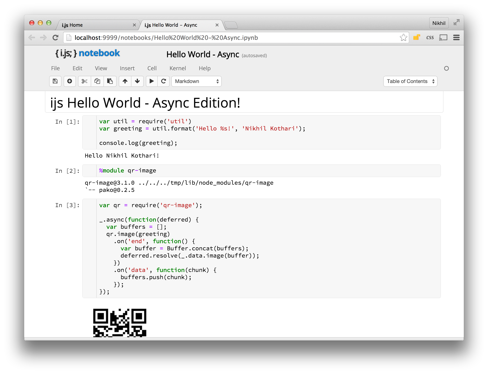

# ijs

A kernel for authoring JavaScript interactively using IPython notebooks,
built on top of node.js.

## Screenshots

### Hello World
Use javascript, run it in node.js, and install/require node modules from npm ... 

### Hello World - Async
Of course, lots of node.js APIs are async, and you can write async code in notebook cells too!

### Working with JSON
JSON is everywhere, and you can use `%%json` to easily declare JSON data. There is also auto-complete that spans across notebook cells.

### HTTP requests
Making HTTP requests is easy using the popular `request` npm module.

### Client-script
You can also generate HTML using `%%html` blocks and client-script using `%%script` to use libraries such as d3.js.

## Using IJavaScript

More detailed instructions coming soon!
